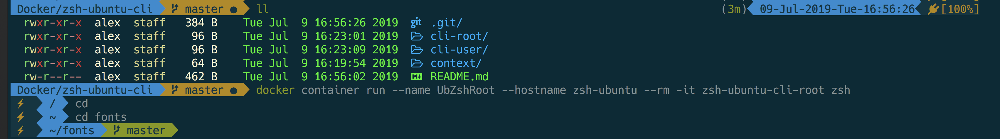

# Run ZSH shell in Ubuntu on Docker with Powerline Fonts and Agnoster Theme
### To run as root
```
docker build -t zsh-ubuntu-cli-root -f cli-root/Dockerfile context
docker container run --name UbZshRoot --hostname zsh-ubuntu --rm -it zsh-ubuntu-cli-root zsh
```
### To run as user
```
docker build -t zsh-ubuntu-cli-user -f cli-user/Dockerfile context
docker container run --name UbZshUser --hostname zsh-ubuntu --rm -it zsh-ubuntu-cli-user  su -l user -c "/usr/bin/zsh"

```

